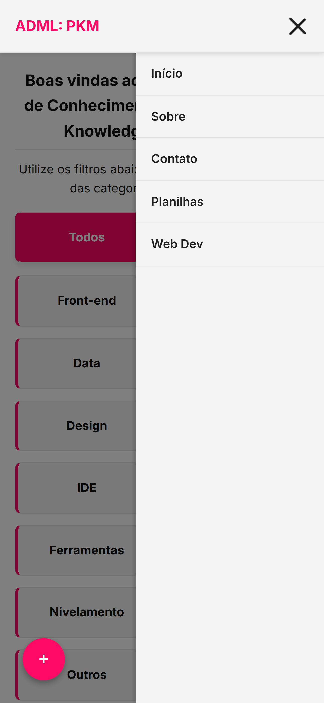
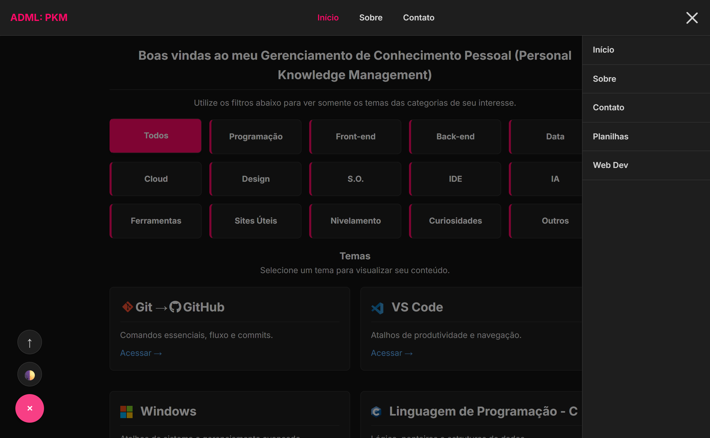
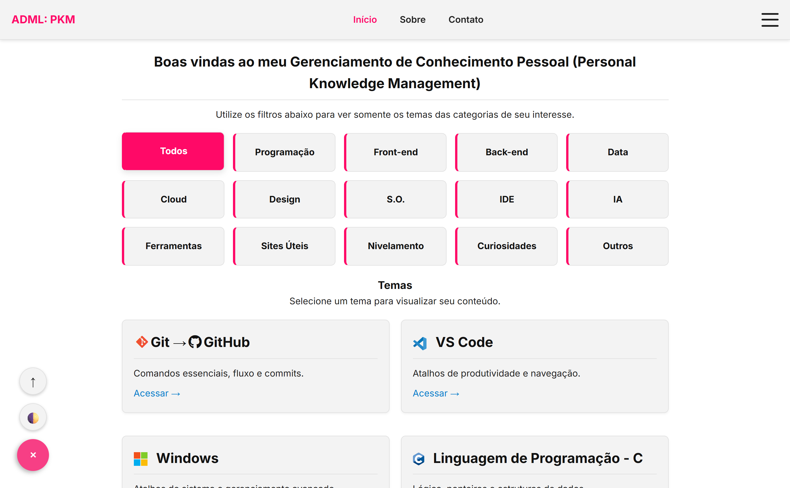

# 🧠 ADML: PKM (Personal Knowledge Management)

> **Central de Conhecimento Pessoal: Referências rápidas, Cheatsheets e Tutoriais para Desenvolvedores.**


## 📖 Sobre o Projeto

O **ADML PKM** é uma aplicação web estática projetada para ser uma base de conhecimento pessoal livre de distrações. Diferente de documentações oficiais extensas, este projeto foca em **agilidade**: atalhos, snippets de código, configurações essenciais e guias "direto ao ponto" para as ferramentas usadas no dia a dia de um desenvolvedor e *power user*.

O projeto foi construído do zero utilizando **Vanilla JavaScript** e **CSS Moderno**, sem dependência de frameworks pesados, garantindo performance máxima e facilidade de manutenção.

---

## ✨ Funcionalidades Principais

* **⚡ Performance Nativa:** Zero frameworks, sem *build steps* complexos. Apenas HTML, CSS e JS puro.
* **🌗 Dark Mode Nativo:** Detecção automática de preferência do sistema e alternância manual via menu flutuante (FAB).
* **📱 Mobile First:** Layout responsivo com menu lateral (off-canvas) e navegação otimizada para toque.
* **🧩 Arquitetura Modular:** Componentes de UI (Navbar, FAB, Filtros) isolados em classes ES6 reutilizáveis.
* **📂 Roteamento Inteligente:** Sistema de caminhos relativos (`ROOT_PATH`) que permite organizar conteúdo em subpastas sem quebrar links.
* **🔍 Filtro de Categorias:** Filtragem dinâmica de conteúdo na Home Page (Frontend, Backend, Ferramentas, etc.).

---

## 🛠️ Tech Stack

O projeto utiliza tecnologias web padrão focadas em longevidade e compatibilidade:

* **HTML5:** Estrutura semântica.
* **CSS3:**
    * **CSS Variables:** Para gerenciamento de temas (cores, fontes, espaçamentos).
    * **Flexbox & Grid:** Para layouts responsivos.
    * Design System próprio.
* **JavaScript (ES6+):**
    * Orientação a Objetos (Classes).
    * Manipulação de DOM sem jQuery.
* **Ícones:** FontAwesome 6.5 (CDN).
* **Fontes:** Inter & Fira Code (Google Fonts).

---

## 📚 Conteúdo Disponível

O PKM está organizado em trilhas de conhecimento:

### 💻 Desenvolvimento
- **Git & GitHub:** Fluxo de trabalho, comandos essenciais e Conventional Commits.
- **Web Development:**
    - Setup de Ambiente (VS Code, Extensões).
    - HTML & CSS Básico (Box Model, Flexbox).
    - Teoria da Web (HTTP, DNS, Cliente-Servidor).
    - JavaScript Moderno (DOM, Eventos).
    - React (Conceitos, Virtual DOM, Hooks).
- **Backend / Lógica:**
    - Linguagem C (Ponteiros, Structs, Memória).

### 🛠️ Ferramentas & Produtividade
- **VS Code:** Atalhos de teclado e produtividade.
- **Planilhas:**
    - **Excel:** Fórmulas avançadas, VBA e Power Query.
    - **Google Sheets:** Query function, Apps Script e Regex.
- **Microsoft Word:** Formatação acadêmica e estilos.

### 🖥️ Sistema Operacional
- **Windows:** Winget, PowerToys, WSL e atalhos de gerenciamento de janelas.

---

## 📂 Estrutura de Pastas

```text
ADML-PKM/
│
├── index.html              # Home Page (Dashboard)
├── about.html              # Sobre o projeto
├── contact.html            # Formulário de contato
│
├── assets/                 # Imagens e ícones SVG
│   └── img/
│       └── imgsREADME/     # Prints para o README
│
├── css/                    # Estilos Globais
│   ├── main.css            # Reset e estilos base
│   └── variables.css       # Variáveis de cores (Temas)
│
├── js/                     # Scripts Globais
│   └── app.js              # Inicializador da aplicação
│
├── components/             # Módulos Reutilizáveis
│   ├── NavMenu/            # Barra de Navegação Responsiva
│   ├── FAB/                # Botão Flutuante (Tema/Scroll)
│   └── pkm-index/          # Lógica de Filtros da Home
│
├── web_dev/                # [Módulo] Web Development
│   ├── web_dev.html        # Index do Módulo
│   ├── setup_inicial.html
│   ├── html_css_basico.html
│   └── ...
│
└── planilhas/              # [Módulo] Planilhas
    ├── planilhas.html      # Index do Módulo
    ├── excel.html
    └── gsheets.html
```

---

## 🔮 Roadmap & Evolução da Arquitetura

O projeto segue uma abordagem iterativa. A versão atual priorizou a entrega de valor (conteúdo), mas uma **refatoração arquitetural** já está mapeada para garantir escalabilidade e adesão aos princípios de *Clean Code*.

### 🚧 Próximos Passos (Migração v2):

A estrutura estática atual será migrada para uma abordagem **Data-Driven (MVC-Lite)** utilizando JavaScript Vanilla Orientado a Objetos:

1.  **Centralização de Dados (Model):** Criação de um arquivo `data/contentDB.js` que servirá como *Single Source of Truth* (Fonte Única da Verdade) para todos os cards e links do sistema.
2.  **Renderização Dinâmica (Controller):** Implementação do componente `CardManager.js`, responsável por ler os dados e gerar o HTML automaticamente, ajustando rotas (`./` ou `../`) dependendo de onde o usuário está.

### ✅ Benefícios Esperados:
* **DRY (Don't Repeat Yourself):** Eliminação completa da duplicação de código HTML entre a `index.html` e as páginas de módulos.
* **Manutenibilidade:** Adicionar um novo tutorial exigirá apenas a inserção de um objeto no arquivo JSON, sem tocar no HTML.
* **Consistência:** Garantia de que títulos, ícones e descrições sejam idênticos em todas as listagens do site.

---

## 🚀 Como Rodar Localmente

1.  **Clone o repositório em:** [https://github.com/LeonardoDalmazzo/ADML-PKM.git](https://github.com/LeonardoDalmazzo/ADML-PKM.git)
    ```bash
    git clone https://github.com/LeonardoDalmazzo/ADML-PKM.git
    ```

2.  **Abra a pasta no VS Code:**
    ```bash
    cd ADML-PKM
    code .
    ```

3.  **Rode com Live Server:**
    * Instale a extensão **Live Server** no VS Code.
    * Clique em "Go Live" no canto inferior direito.
    * O projeto abrirá automaticamente no seu navegador em `http://127.0.0.1:5500`.

---

## 📸 Screenshots

| Mobile Menu | Home Page Dark Mode | Home Page (Light) |
| :---: | :---: | :---: |
|  |  |  |

---

## 🤝 Contribuição

Contribuições são muito bem-vindas! Se você quiser adicionar uma nova *cheatsheet*, corrigir um erro ou melhorar o design:

1.  Faça um **Fork** do projeto.
2.  Crie uma **Branch** para sua feature (`git checkout -b feat/nova-cheatsheet`).
3.  Commit suas mudanças seguindo o padrão **Conventional Commits** (`git commit -m 'feat: adiciona guia de docker'`).
4.  Faça o **Push** para o seu fork (`git push origin feat/nova-cheatsheet`).
5.  Abra um **Pull Request** no repositório original.

---

## 📝 Licença

Este projeto está sob a licença MIT. Sinta-se livre para usar, estudar e modificar para seus próprios fins de aprendizado.

---
<p align="center">
  Powered by: <strong>Leonardo Dalmazzo (ADML™)</strong>
</p>